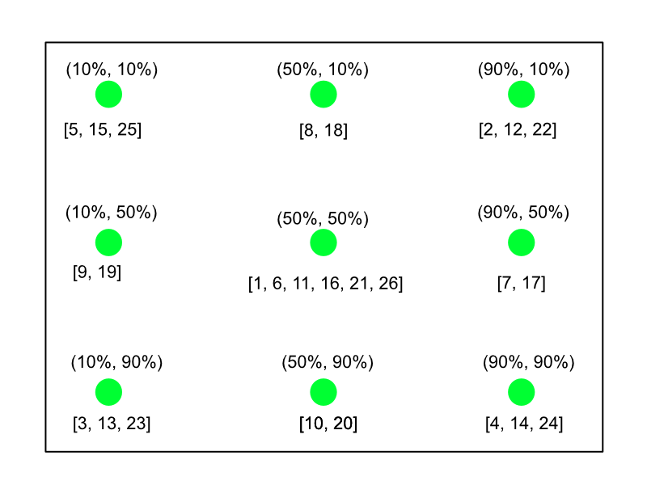
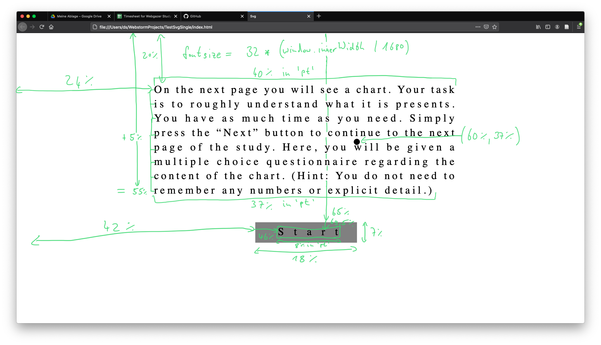
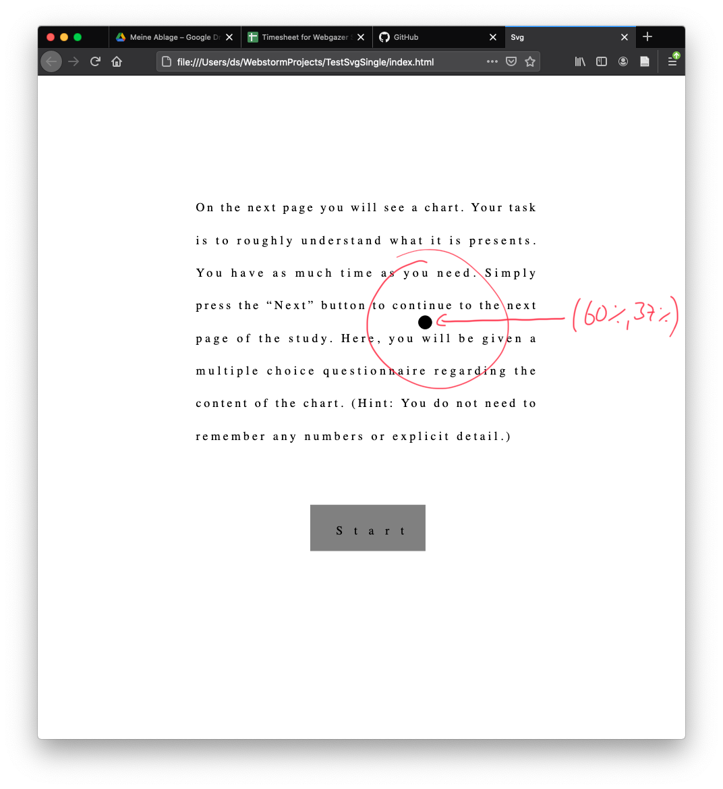
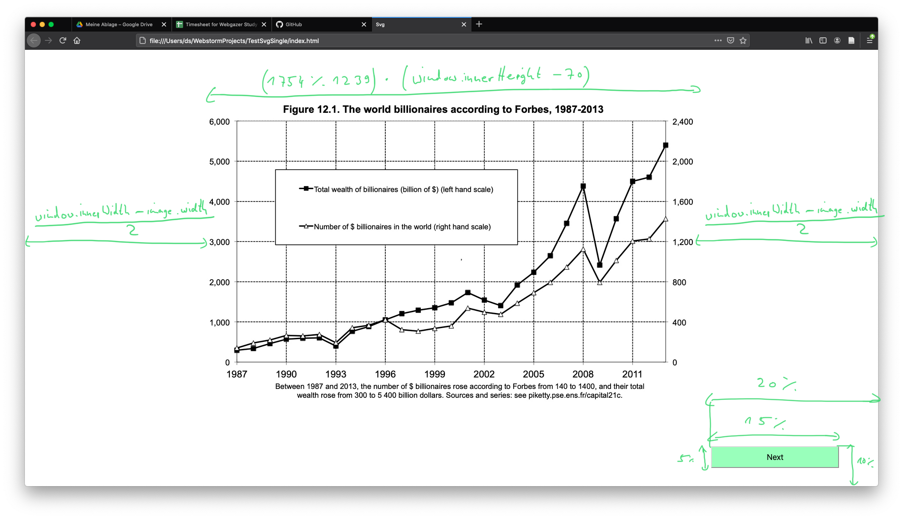
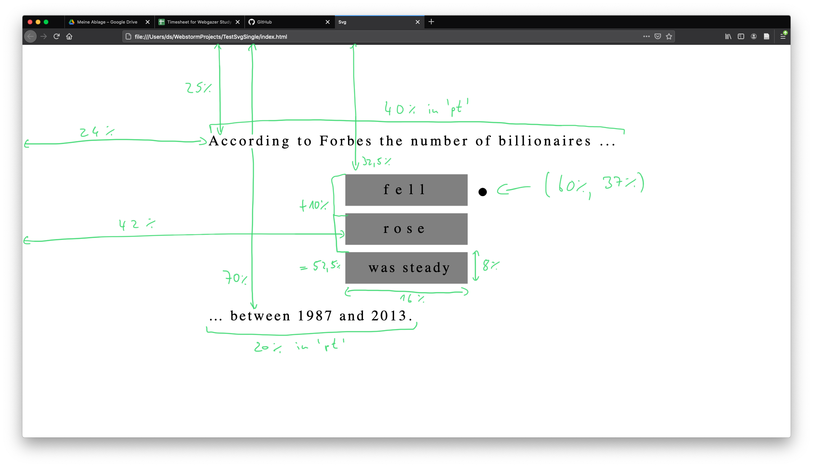
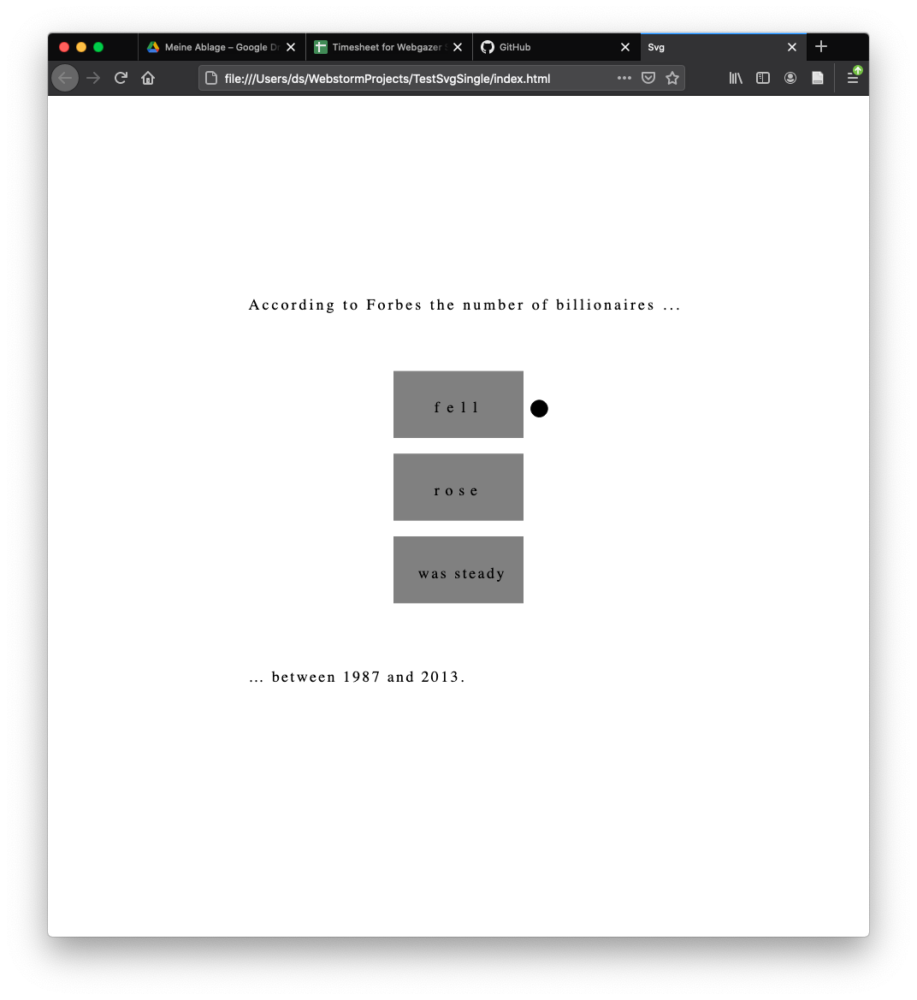

# golden-dataset
Here you can find data from Daniel's eyetracking study at the LLZ. This data will form the base of the adsata "golden" dataset. Meaning we can reliably use this data for testing new features, metrics, and visualisations. 

You can access the data in two ways:

- adsata-golden.json file for all the data --> Attched to this repo
- Access with POST request to a Graph API --> see below for access details and the schem.graphql file for the Graph schema.

## Study Summary
This study was meant to collect webgazer data in combination with hardware data. The hardware used is called Tobii Pro X3-120 (https://www.tobiipro.com/product-listing/external-processing-unit/). 

The main point is to synchronise the data from Webgazer and Tobii Pro, to use the labeling of the data as *saccade* or *fixation*. Furthermore we can calculate how accurate Webgazer behaves on real stims in comparison to (expensive) hardware.

For the moment it is not clear if this synchronisation works and if we can use the classification from the hardware. Therefor the data is not labeled yet.

In a second step of this study, we want to make it public available. The so called *wild* data will have no comparison to hardware data, but can be used to compare it with the *inlab* data. So we can evaluate how Webgazer behaves on diffrent computers, operation systems, browsers, screen sizes, external conditions.

## Variables Measured

### Empirical data
In the beginning of the session, each participant is asked for some data, divided in three sections: *personal*, *information for face recognition* and *information about the enviornment*.

Note: The study can be done, leaving some or all empirical data questions empty.

#### Personal

- Age (Number, integer)
- Computer use per day (in hours, Number)
- Glasses (Yes, No)
- Contact lenses (Yes, No)
- Gender (male, femal)
- Weak vision (Yes, No)

#### Information for face recognition

- eye color (options: blue, green, black, brown, gray, other)
- skin color (options: light, middle, dark)
- Special features of the face (e.g hat, beard) (String)

#### Information about the enviornment

- monitor size (Number)
- aprx. distance to the monitor
- Mouse or Trackpad?
- Ambient light (options: Very light, light, middle, dark, very dark)

### Meta data

Some meta data is collected:

1. timestamp: very beginning of the study
2. timestampForSync: after the calibration when the real study (reading page) starts.
3. errorRateValue: calculated from the webgazer points of the last 16 seconds of the calibration, where a big circle in the middle of the screen gets smaller until it vanished. Note: The event listeners of webgazer are here already removed. 
4. windowInnerWidth: width of browser inner window
5. windowInnerHeight: heigth of browser inner heigth (Note: This values are calculated at the end of the study. If the browser window was resized during the study, we do not know. In general this should be forbidden.)
6. correctAnswer: if the answer on the third page (s. b.) was correct. This is mainly a test to see, if the participant has understand the plot. 

### Webgazer data

The webgazer data is divided in four sections: *calibration*, first page = *readingPage*, second page = *plotPage* and third page = *questionPage*.

Each data point has the structure:

- (timestamp, x, y, label).

The label can be empty.

#### calibrationData

The calibration step has 26 circles to click on (5 times) and in the end one big circle getting smaller (over 16 secondes) until it vanishes. 

##### 26 circles

The position (x%, y%) and order [...,...] of the 28 circles is as in the image below shown. 



The labels of the data are *fixation* after the first (of five) click and *saccade* after the 5th click.

##### Descending circle

The last circle is positioned in the middle and lasts 16 seconds until it is vanished.
The label of all data points is *errorRate*, because from this points I calculate the *errorRateValue* on the client side. With this value we could decide to repeat the calibration step, if the value is to high. In this study however is no repetition. The value is only stored to the database.

#### readingPage

Every position in the study is in percent, because after the laboratory setup, we want to make the study public available. This means that participants can have very different screen sizes. So to make sure, everyone has the same view, everything needs to be done in percent.

Every position is shown in the image below:



To show the example how every data point (black circle at (60%, 37%)) stays the same, I made a screenshot with half of the screen size:

 

Note how the circle remains at the same (word) position.

### plotPage

To make the image available on all screen sizes, its ratio is multiplied by the screen size. So it remains always in the same proportion.

The image is centerd, but 70px moved to the top, otherwise the browser window would be scrollable. 

Take all the information from the image below:




### questionPage

If the correct answer was selected is stored in the database. The position and sizes are shown in the image below.



See also the same proportions on a smaller screen:



## Graph API Access

You can access the Graph API with the following credentials. Please add your email and password, I have added all of you as admins to the Cluster for the data. 

You can query this data in GraphQL [(https://graphql.org)].

```curl
http.post({
  "url": "https://eu-west-1.aws.realm.mongodb.com/api/client/v2.0/app/adsata-golden-kfkva/graphql",
  "headers": {
    "email": "<User's Email Address>",
    "password": "<User's Password>",
  },
  "body": '{"query":"query  **ADD TYPE** {\n  **SOMETYPE** {\n    **SOMETYPE**\n    **SOMETYPE**\n  }\n}"}'
})
```


## Graph Schema

See the **schema.graphql** file for the graph schema.

